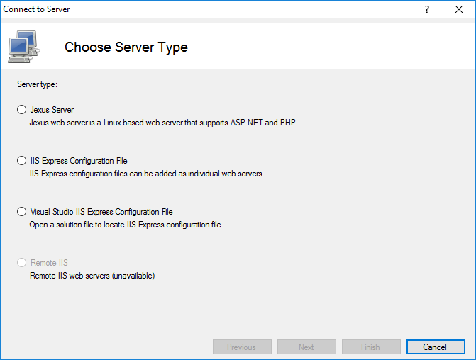
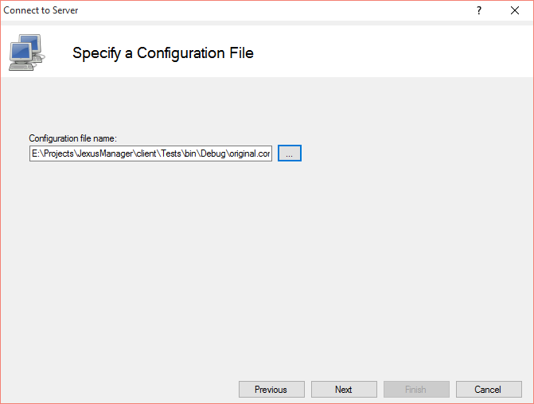
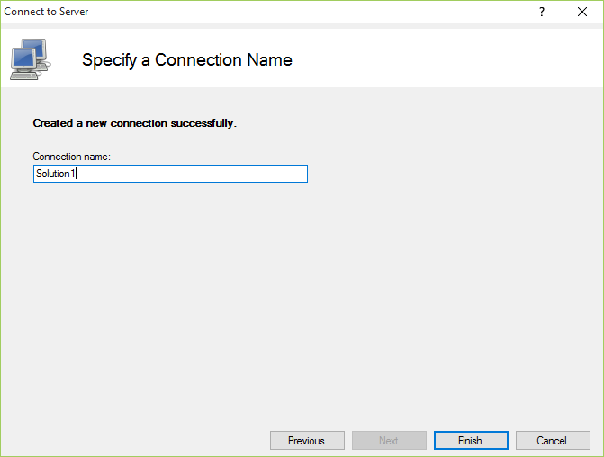

Features
========

By `Lex Li`_

This page shows you the main features of Jexus Manager.

.. contents:: In this article:
  :local:
  :depth: 1

Background
----------
Jexus Manager is designed to be compatible with Microsoft IIS Manager. Though it is still in beta, many features are already well developed and tested.

Add New Servers
---------------
By clicking "File | Connect to a Server…” menu item, new web servers can be easily added and then managed by Jexus Manager.

Currently new IIS Express custom configuration and remote Jexus web servers can be added.

Add IIS Express Custom Configuration
^^^^^^^^^^^^^^^^^^^^^^^^^^^^^^^^^^^^
Visual Studio 2015 adds custom IIS Express configuration to new projects at ``($SolutionDir)\.vs\config\applicationHost.config`` .

.. note:: IIS Express custom configuration is documented in `this blog post <http://blogs.msdn.com/b/webdev/archive/2015/04/29/new-asp-net-features-and-fixes-in-visual-studio-2015-rc.aspx>`_ .

By adding such configuration files into Jexus Manager, web sites and applications can be easily managed.

Each server instances should have a unique name.

Default Servers
---------------
If a global IIS Express configuration file can be found at ``%userprofile%\documents\iisexpress\config\applicationhost.config`` or 
``%userprofile%\my documents\iisexpress\config\applicationhost.config`` , a default server called "IIS Express" is automatically 
created by Jexus Manager.

If local IIS is installed, a default server with the machine name is automatically created by Jexus Manager.

Manage Servers
--------------
Once a server is added, it can be managed by choosing one of the categories in the middle panel.

.. image:: /_static/jexus.png

.. note:: If the server node is not yet expanded for management, double click the node so that Jexus Manager tries to load its configuration.

Related Resources
-----------------

- :doc:`/getting-started/install`
