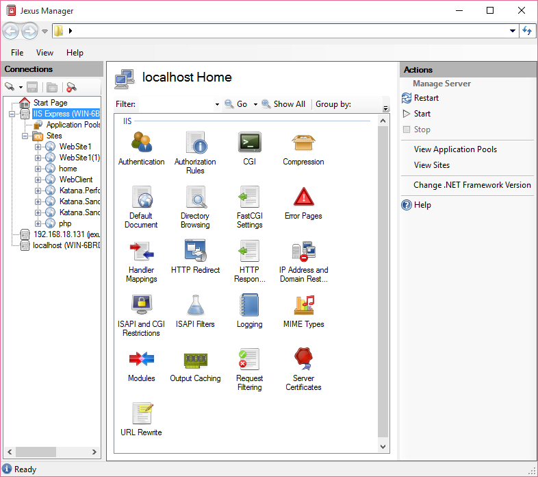

.. jexusmanager documentation master file, created by
   sphinx-quickstart on Sat Jan 9 17:51:25 2015.
   You can adapt this file completely to your liking, but it should at least
   contain the root `toctree` directive.
   
.. _index:

Jexus Manager Documentation
===========================

Jexus Manager is the management console designed for Jexus web server， IIS
Express and local IIS instances.

It can be downloaded from `GitHub <https://github.com/jexuswebserver/jexusmanager/releases>`_ .

The source code can now be found at `GitHub <https://github.com/jexuswebserver/JexusManager>`_ .

Issues can be reported at `GitHub <https://github.com/jexuswebserver/jexusmanager/issues>`_ .

Topics
------

.. toctree::
    :titlesonly:

    getting-started/index
    tutorials/index
    support/index
