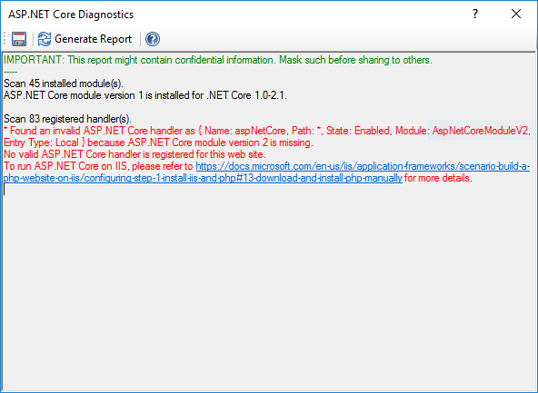

ASP.NET Core Diagnostics for IIS/IIS Express
============================================

By `Lex Li`_

This page shows you how to use ASP.NET Core Diagnostics.

.. contents:: In this article:
  :local:
  :depth: 1

Background
----------
An ASP.NET Core web app requires certain setup before being executed properly.
However, the configuration steps are complex and certain things might be
neglected. A diagnostics tool can reveal typical configuration mistakes and
help resolve them.

The Built-in ASP.NET Core Diagnostics
-------------------------------------
For web sites opened in Jexus Manager, there is an action called ASP.NET Core
Diagnostics showed.

A report is generated when "Generate Report" button is clicked.

Typical things analyzed by ASP.NET Core Diagnostics,

* ASP.NET Core module on IIS.
* Visual C++ 2015 runtime.
* Application pool (No Managed Code).
* Handler in web.config.
* Web app runtime version.

Related Resources
-----------------

- :doc:`/getting-started/install`
- :doc:`/getting-started/features`
- :doc:`/tutorials/https-binding`
- :doc:`/tutorials/binding-diagnostics`
- :doc:`/tutorials/ssl-diagnostics`
- :doc:`/tutorials/inplace-elevation`
- :doc:`/tutorials/self-signed`
