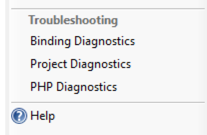
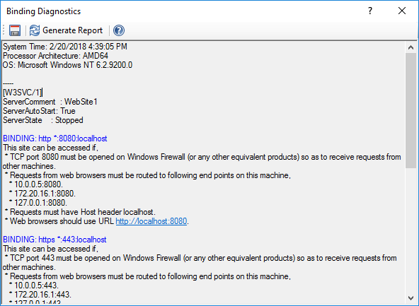

Binding Diagnostics
===================

By `Lex Li`_

This page shows you how to use Binding Diagnostics.

.. contents:: In this article:
  :local:
  :depth: 1

Background
----------
IIS sites use bindings to determine what kind of incoming HTTP requests they would handle. However, it is usually not intuitive to know
what kind of requests go to which binding, without learning HTTP protocol itself and how web browser/IIS work together.

The Built-in Binding Diagnostics
----------------------------------------------
For web sites opened in Jexus Manager, there is now a Diagnostics button showing in the Bindings dialog,

Click this button and the Diagnostics dialog shows. A report is generated when "Generate Report" button is clicked.

Related Resources
-----------------

- :doc:`/getting-started/install`
- :doc:`/getting-started/features`
- :doc:`/tutorials/https-binding`
- :doc:`/tutorials/inplace-elevation`
- :doc:`/tutorials/self-signed`
- :doc:`/tutorials/ssl-diagnostics`
