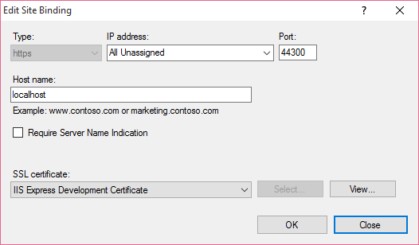
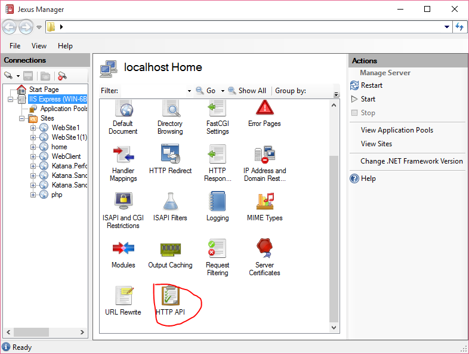
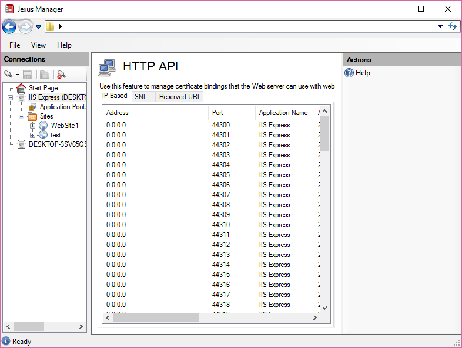
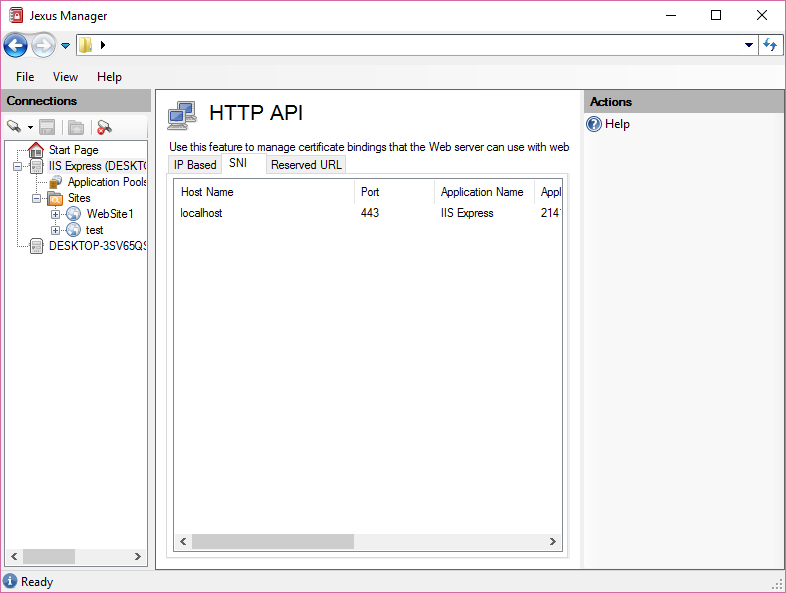
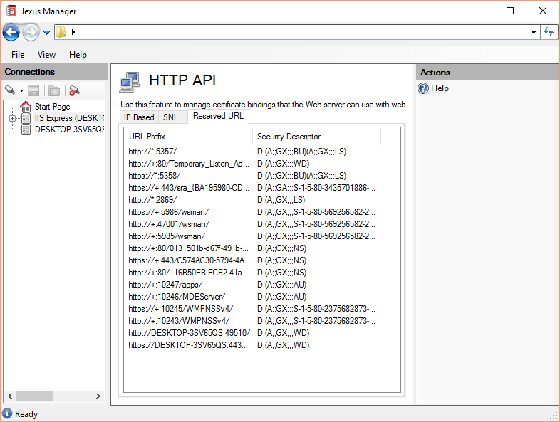

HTTP API Page
=============

By `Lex Li`_

This page shows you how to use Jexus Manager HTTP API page to review IIS/IIS
Express HTTPS bindings.

.. contents:: In this article:
  :local:
  :depth: 1

Background
----------
You probably wonder how IIS is able to serve HTTPS bindings for web sites,
especially when the site bindings map to the same IP:port combination.

For example, I have a server with a single IP address (``192.168.1.2``), and it
hosts two sites, ``https://lextudio.com`` and ``https://sharpsnmp.com``. The
relevant part in ``applicationHost.config`` file looks like below,

.. code-block:: xml

  <site name="php" id="8">
    <bindings>
      <binding bindingInformation="192.168.1.2:443:lextudio.com" protocol="https" />
    </bindings>
    <application path="/" applicationPool="32bit">
      <virtualDirectory path="/" physicalPath="e:\test1" />
    </application>
  </site>
  <site name="php" id="8">
    <bindings>
      <binding bindingInformation="192.168.1.2:443:sharpsnmp.com" protocol="https" />
    </bindings>
    <application path="/" applicationPool="32bit">
      <virtualDirectory path="/" physicalPath="e:\test2" />
    </application>
  </site>

Where are the certificates? And how does Windows pick up the right certificate?

When modern web browsers create an HTTPS connection to a web server like IIS,
the initial SSL/TLS handshake packet contains the host name (matching the
Host header in future HTTPS requests). This is the so called Server Name
Indication (SNI).

When Windows receives such a handshake packet, it relies on a few mappings in
HTTP API to determine which server certificate to present in handshake
response,

* Check SNI based mappings first. If any mapping matches the host name in
  the request, return the certificate in that mapping.
* If there is no SNI mapping matched, check IP based mappings. If the
  destination IP and port number of the request matches a mapping, return the
  certificate of that mapping.
* If no mapping matches at all, this HTTPS connection cannot be created.

.. note:: If a web browser does not support SNI, then only IP based mappings
   is scanned. Examples: All browsers on Windows XP.

.. note:: If your Windows/IIS is too old to support SNI, then only IP based
   mappings is scanned. Examples: Windows Vista/Windows 7/Windows Server 2008/
   Windows Server 2008 R2.

.. note:: Each SNI site bindings should have a corresponding SNI mapping in
   HTTP API. Otherwise, there is something wrong.

   The same does not apply to non-SNI site bindings, as they share the same IP
   based mapping in HTTP API. So in IIS Manager/Jexus Manager if you changed
   the certificate bind to such a site binding, remember you in fact changed a
   mapping that affects multiple site bindings (more than the one you changed).

So if you notice a wrong certificate is displayed in web browser when you
navigate to a page, time to review the mappings.

The quickest way to check the mappings is to use Jexus Manager (more details
below). Jexus Manager uses such mappings to display the correct certificate in
binding dialog,

.. important:: All can be done via equivalent ``netsh`` commands if you prefer
   not to download and use such a visual tool. Ask Google to learn the commands
   then.

IP Based Bindings
-----------------
If "Require Server Name Indication" is not checked, then this binding is not
SNI enabled. It also means for this binding, the certificate is registered to
the IP address + port number (in this example, ``0.0.0.0:44300``). Windows
stores the certificate information in a private storage for http.sys to read,
which can be queried via ``netsh http show sslcert``.

Jexus Manager features a new page to show the list,

It is very clear that the certificate mappings are here.

.. note:: IIS Express creates mappings for ``0.0.0.0:44300``–``0.0.0.0:44399``
   during installation, so that non administrators can bind HTTPS sites to such
   mappings. That's also why Visual Studio uses a default port between 44300
   and 44399 for new ASP.NET or ASP.NET Core projects on IIS Express.

Due to the limitation of such mappings, we know for a single IP end point,
only a single certificate can be registered. That’s why when we attempt to
host multiple HTTPS sites on a single IP end point we could only use a
wildcard certificate or a UC certificate.

.. important:: Equivalent command line is ``netsh http show sslcert``.

SNI Based Bindings
------------------
Starting from Windows 8/IIS 8 and above, we can create SNI based in addition
to IP based bindings. This allows multiple certificates to be bind to a single
IP end point.

SNI based mapping for certificates is displayed under SNI tab. They are bind
to host name + port number instead of IP end point + port number.

Such SNI based mappings are automatically created by Jexus Manager when you
add SNI based bindings to web sites. They are also removed automatically when
such bindings are removed from sites.

.. important:: Equivalent command line is ``netsh http show sslcert``.

Reserved URLs
-------------
Reserved URLs are displayed under Reserved URL tab.

.. note:: Microsoft has more information about reserved URLs
   `here <https://learn.microsoft.com/iis/extensions/using-iis-express/handling-url-binding-failures-in-iis-express>`_ .

Many applications would register their own URL reservations. Typical
applications include Microsoft SQL Server Reporting Services.

Reservations can conflict with each other, and that can lead to problems
like IIS/IIS Express cannot start to monitor certain site bindings.

.. note:: When troubleshooting conflicts, reserved URLs only provide partial
   information. A process running as administrator can hook to Windows HTTP API
   without any reservation (like a Windows service).

.. important:: Equivalent command line is ``netsh http show urlacl``.

Related Resources
-----------------

- :doc:`/getting-started/install`
- :doc:`/getting-started/features`
- :doc:`/tutorials/self-signed`
- :doc:`/tutorials/inplace-elevation`
- :doc:`/tutorials/ssl-diagnostics`
- :doc:`/tutorials/binding-diagnostics`
