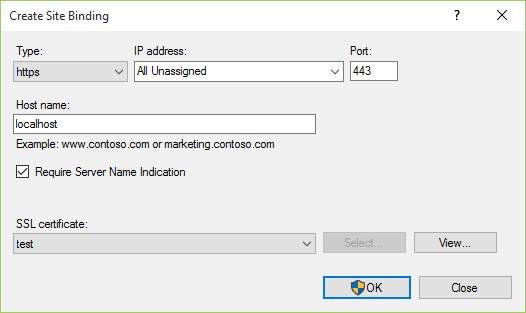
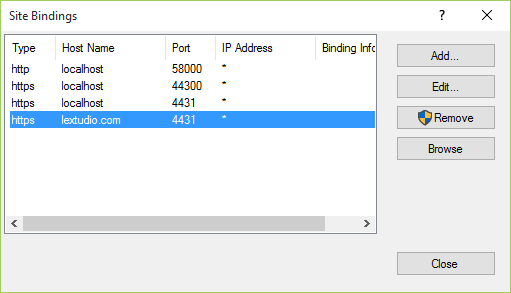
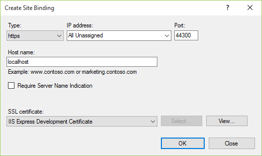
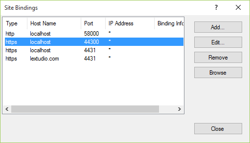

On Demand Elevation
===================

By `Lex Li`_

This page shows you how Jexus Manager informs that UAC elevation is required.

.. contents:: In this article:
  :local:
  :depth: 1

Background
----------
Jexus Manager can run as a normal user to navigate the settings. Meanwhile, web servers such as IIS Express can run as a normal user.

However, there are certain operations that require administrator permissions to execute. Some examples are certificate creation and HTTP API modification.

Elevation Shield
----------------
The UAC shield icon appears whenever some operations require administrator permissions. 

By clicking such buttons, permission elevation is executed on demand. There is no need then to run Jexus Manager entirely as administrator.

For operations that do not require elevation, the buttons are displayed without the shield icon.

Related Resources
-----------------

- :doc:`/getting-started/features`
