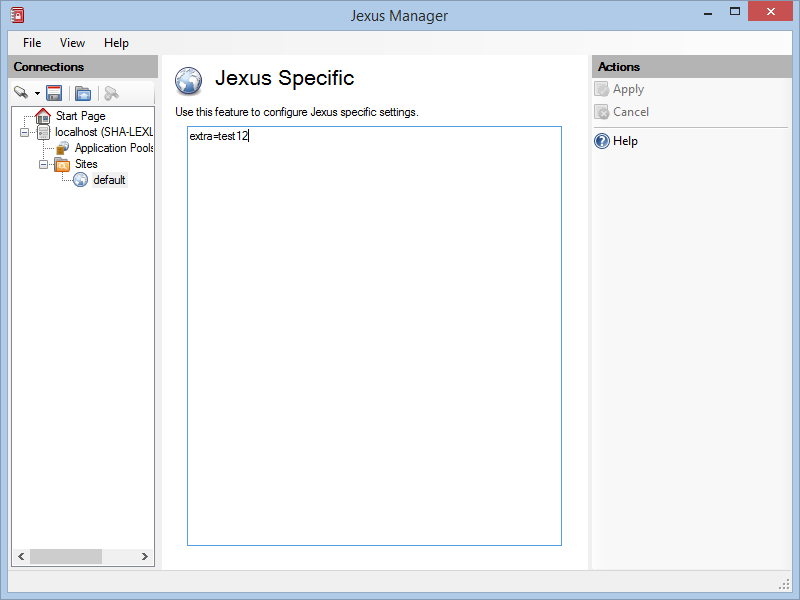

Jexus Specific
==============

By `Lex Li`_

This page shows you how to use Jexus Manager to manage Jexus specific settings.

.. contents:: In this article:
  :local:
  :depth: 1

Background
----------
Jexus web server does have some special settings that are not yet mapped to IIS configuration system.

Jexus Page
----------
Jexus Manager displays a Jexus page for every Jexus web servers it manages.

Since Jexus settings are stored as key-value pair, this simple editor allows you to modify the pairs freely and apply the changes at will when everything looks good to you.

.. note:: If you are not sure of any setting, you can click the Help link and navigate to our documentation site.

Related Resources
-----------------

- :doc:`/getting-started/install`
- :doc:`/getting-started/features`
