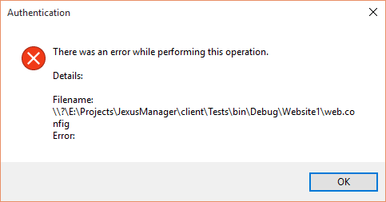
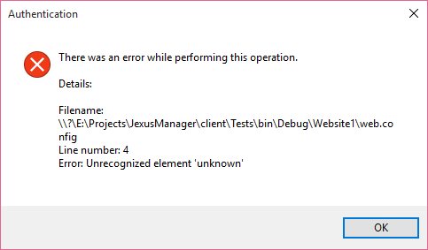

Local IIS Instance
==================

By `Lex Li`_

This page shows you how to use Jexus Manager to manage local IIS instance.

.. contents:: In this article:
  :local:
  :depth: 1

Background
----------
There are several issues with IIS Manager that you might not be able to use it to troubleshoot IIS configuration issues，

* IIS Manager strictly requires administrator permissions.
* When a site configuration contains errors, IIS Manager shows an error dialog that tells nothing useful. (A 500.19 error 
  page would be showed when accessing such a site.)

Jexus Manager Benefits
----------------------
Jexus Manager can run as a normal user to navigate the settings, and its exception dialog provides the same or even better 
error message when an error in configuration is detected.

Related Resources
-----------------

- :doc:`/getting-started/install`
- :doc:`/getting-started/features`
