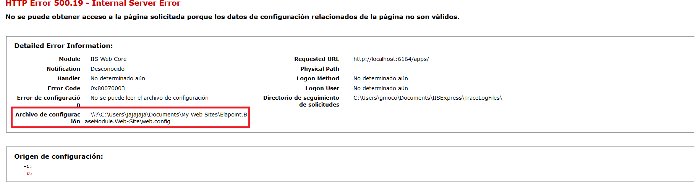
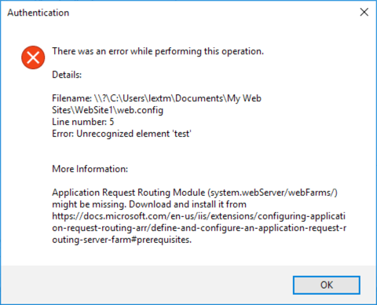

OOB Related 500.19 Errors
=========================

By `Lex Li`_

This page shows you how to use Jexus Manager to analyze IIS Out-Of-Band (OOB)
related 500.19 errors.

Background
----------
IIS 7+ functionality can be extended by installing OOB modules. For example,
the following configuration can be put in `web.config` of a web site,

.. code-block:: xml

  <configuration>
    <system.webServer>
      <rewrite>
        <rules>
          <rule name="Rewrite to article.aspx">
            <match url="^article/([0-9]+)/([_0-9a-z-]+)" />
            <action type="Rewrite" url="article.aspx?id={R:1}&amp;title={R:2}" />
          </rule>
        </rules>
      </rewrite>
    </system.webServer>
  </configuration>

It relies on IIS URL Rewrite module, which is a separate download. If the web
server does not yet have the module installed, an error page would occur,

The error message does not reveal enough information, nor the root cause.

Detailed Error Message by Jexus Manager
---------------------------------------
If you use Jexus Manager to open this web site and check any of its settings
(like Authentication), a thorough analysis is performed on `web.config`, and
such issues would be identified and reported,

Clearly Jexus Manager not only shows the exact line number in the config file,
but also indicates the OOB module name and its download link. Simply follow the
link to download and install the module, and the errors would disappear.

The most commonly missed modules are,

* URL Rewrite module
* ASP.NET Core module
* CORS module

Related Resources
-----------------

- :doc:`/getting-started/install`
- :doc:`/getting-started/features`
- :doc:`/tutorials/vs-diagnostics`
- :doc:`/tutorials/express-specific`
- :doc:`/tutorials/local-iis`
