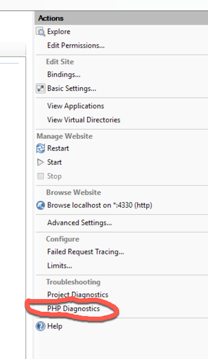
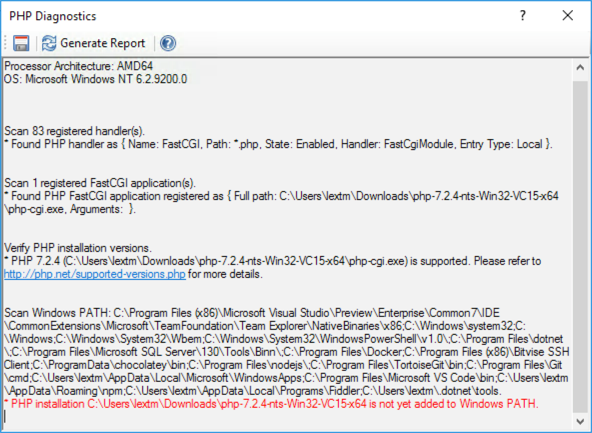

PHP Diagnostics for IIS/IIS Express
===================================

By `Lex Li`_

This page shows you how to use PHP Diagnostics.

.. contents:: In this article:
  :local:
  :depth: 1

Background
----------
IIS supports PHP via FastCGI. However, registering PHP properly on IIS has been
a challenge. Either manually or via Web Platform Installer, you might get a
broken installation.

Thus, proper tooling is needed to diagnose such broken installation and learn
which steps can be taken to make it healthy.

.. attention:: Installing PHP via Web Platform Installer today is often problematic.
   It is highly recommended that you follow `the manual steps <https://docs.microsoft.com/en-us/iis/application-frameworks/scenario-build-a-php-website-on-iis/configuring-step-1-install-iis-and-php#13-download-and-install-php-manually>`_ .

The Built-in PHP Diagnostics
----------------------------
For web sites opened in Jexus Manager, there is an action called PHP
Diagnostics showed.

A report is generated when "Generate Report" button is clicked.

The report also provides reference links which might lead you to the right
track.

.. important:: PHP Manager for IIS is revived at https://www.phpmanager.xyz .

Related Resources
-----------------

- :doc:`/getting-started/install`
- :doc:`/getting-started/features`
- :doc:`/tutorials/https-binding`
- :doc:`/tutorials/inplace-elevation`
- :doc:`/tutorials/vs-diagnostics`
