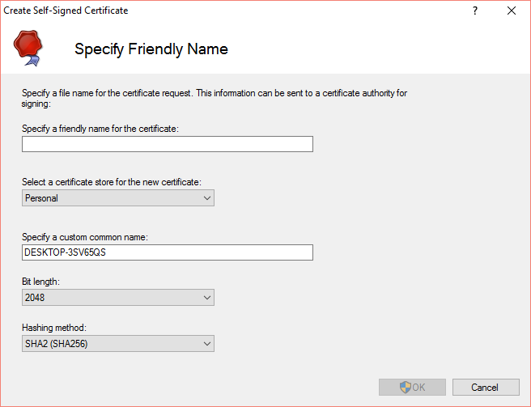
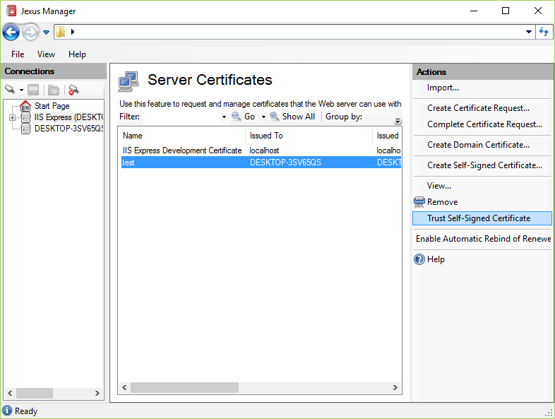

Self-Signed Certificate Generation
==================================

By `Lex Li`_

This page shows you how to use Jexus Manager to generate self-signed
certificates.

.. contents:: In this article:
  :local:
  :depth: 1

Background
----------
Before setting HTTPS bindings, it is very important to configure server
certificates ahead.

.. image:: _static/https_binding.png

Self-signed certificates are usually used during testing.

Self-Signed Certificate Wizard
------------------------------
Jexus Manager's wizard is more powerful than the one IIS Manager offers, so
the generated certificates are Chrome/Firefox friendly.

* It allows you to specify multiple DNS names for the certificate (so-called
  SAN certificates).

  .. note:: It uses the first DNS name as Common Name.

* It allows you to generate wildcard certificates if the DNS names contain
  wildcard.
* It offers SHA2 hashing method.
* It allows you to set expiration date.

In Jexus Manager, the self-signed certificate wizard can be opened as below,

#. Choose a server node in the Connections panel.
#. In the middle panel, click Server Certificates icon to open the management
   page.
#. Under Actions panel, click "Generate Self-Signed Certificate..." menu item.

Fill in the necessary information in this wizard page, and then click OK.
Jexus Manager will generate a new certificate and install it to the desired
store.

To Trust Self-Signed Certificate
--------------------------------
Once a self-signed certificate is generated, it would be sometimes useful to
add it to Trusted Certificate Authorities so that browser side errors are
suppressed. This applies to Internet Explorer, Chrome, and Edge.

Jexus Manager makes it easy to do so,

#. Choose the self-signed certificate from the list.
#. Under Actions panel, click "Trust Self-Signed Certificate".
#. Accept the certificate in the following system dialog.

Related Resources
-----------------

- :doc:`/getting-started/install`
- :doc:`/getting-started/features`
- :doc:`/tutorials/https-binding`
- :doc:`/tutorials/inplace-elevation`
- :doc:`/tutorials/ssl-diagnostics`
