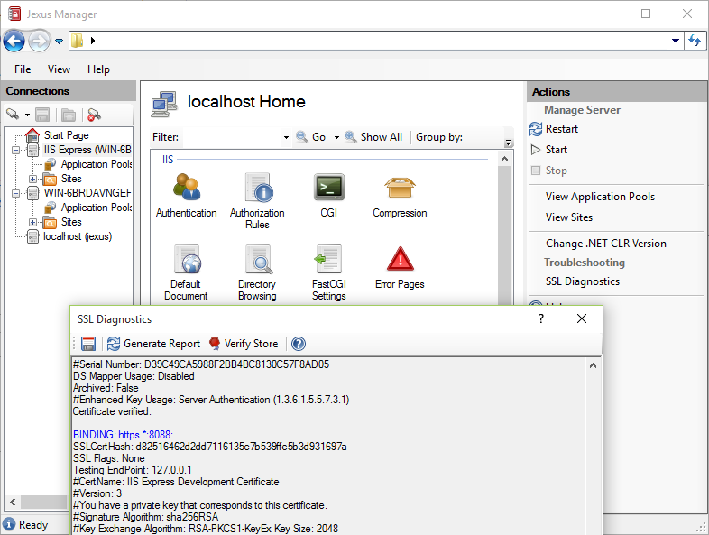
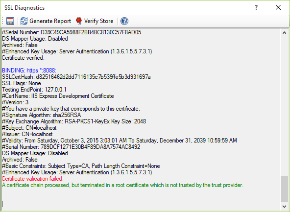

SSL Diagnostics
===============

By `Lex Li`_

This page shows you how to use SSL Diagnostics.

.. contents:: In this article:
  :local:
  :depth: 1

Background
----------
IIS 6 used to have a great troubleshooting tool called `SSL Diagnostics (SSL Diag for short) <https://technet.microsoft.com/en-us/library/cc780913(v=ws.10).aspx>`_ . 
It relied on IIS ADSI API, so this tool was not made part of IIS 7 and above.

Of course you can use the IIS 6 version if you enable IIS 6 Compatibility component on IIS 7 and above, but it would be less convenient.

A Microsoft employee Vijayshinva Karnure developed a newer version that relied only on IIS 7+ new API, 
and `released it on IIS.net <https://www.iis.net/downloads/community/2009/09/ssl-diagnostics-tool-for-iis-7>`_ .

It works for all IIS versions (up to 10), but it does not work for IIS Express.

The Built-in SSL Diagnostics in Jexus Manager
---------------------------------------------
For web servers opened in Jexus Manager, there is an action called SSL Diagnostics showed.

A report is generated when "Generate Report" button is clicked.

Related Resources
-----------------

- :doc:`/getting-started/install`
- :doc:`/getting-started/features`
- :doc:`/tutorials/https-binding`
- :doc:`/tutorials/inplace-elevation`
- :doc:`/tutorials/self-signed`
