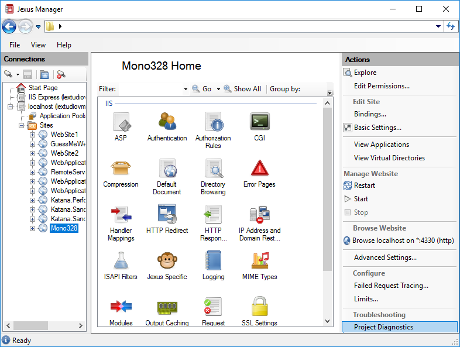
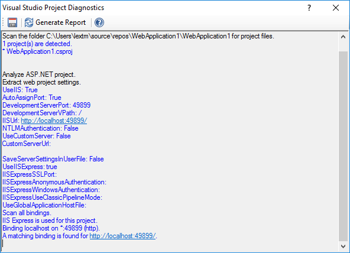

Visual Studio Project Diagnostics
=================================

By `Lex Li`_

This page shows you how to use Visual Studio Project Diagnostics.

.. contents:: In this article:
  :local:
  :depth: 1

Background
----------
Visual Studio web projects contain some IIS settings, while VS also writes some settings directly to IIS/IIS Express configuration files. Sometimes such 
settings go out of sync and you simply hit the famous errors such as "Unable to launch the IIS Express Web server".

The Built-in Visual Studio Project Diagnostics
----------------------------------------------
For web sites opened in Jexus Manager, there is an action called Visual Studio Project Diagnostics showed.

A report is generated when "Generate Report" button is clicked.

Related Resources
-----------------

- :doc:`/getting-started/install`
- :doc:`/getting-started/features`
- :doc:`/tutorials/https-binding`
- :doc:`/tutorials/inplace-elevation`
- :doc:`/tutorials/self-signed`
