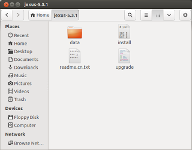
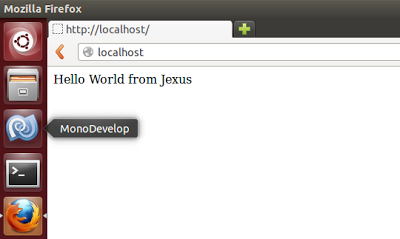

Install Jexus Web Server
========================

By `Lex Li`_

This page shows you how to install Jexus web server on a clean Linux machine. 

.. contents:: In this article:
  :local:
  :depth: 1

Jexus installers can be found at Jexus.org, which is usually in the following URL patterns,

* http://www.linuxdot.net/down/jexus-x.y.z.tar.gz
* http://www.linuxdot.net/down/jexus-x.y.tar.gz

For example, a stable release, such as 5.5.2, can be downloaded from http://www.linuxdot.net/down/jexus-5.5.2.tar.gz.

Install Mono Runtime
--------------------
Xamarin maintains the installation packages. Please follow `the guide <http://www.mono-project.com/docs/getting-started/install/linux/>`_ to install it and then execute

.. code-block:: shell

  mono --version

at terminal to verify that Mono has been installed properly. ``mono-complete`` is recommended.

Mono 4.2.2 and above is recommended version for all Linux/OS X if you know how to get it installed.

Download and Unpack Jexus Files
-------------------------------

.. code-block:: shell

  wget http://www.linuxdot.net/down/jexus-x.y.z.tar.gz
  tar -zxvf jexus-x.y.z.tar.gz

Jexus binary package is downloaded from its official site, and extracted to a folder named "jexus-x.y.z" after this step.

Create Default Web Site
-----------------------

.. code-block:: shell

  sudo mkdir /var/www
  sudo mkdir /var/www/default
  sudo vi /var/www/default/index.html

Press ``i`` on keyboard to enter edit mode.

Type “Hello World from Jexus” and press Esc on keyboard to exit edit mode.

Type ``:wq`` and press Enter on keyboard to exit vi.

``/var/www/default`` is the default web site path for Jexus. In this step we create a test page using vi. You might use any other Linux text editor to create this test page.

Install and Start Jexus
-----------------------

.. code-block:: shell

  cd jexus-x.y.z
  sudo ./install
  cd /usr/jexus
  sudo ./jws start

Here we put Jexus binary to ``/usr/jexus`` folder, grant the jws shell script file execution permission, and then use it to register Jexus modules in Mono GAC and launch 
the HTTP service. 

If you want to install Jexus to another location, please change the commands accordingly.

5. (Optional) Add Jexus to startup commands

.. code-block:: shell

  sudo vi /etc/rc.local
  
Press ``i`` on keyboard to enter edit mode.

Add start command ``/usr/jexus/jws start``.

Press Esc on keyboard to exit edit mode.

Type ``:wq`` and press Enter on keyboard to exit vi.

Now if we open Firefox and navigate to http://localhost, the test page we created is displayed correctly,

Notes
-----
Jexus author has recently found a new way to distribute Jexus web server. It is called Jws.mono at this moment, which means "Jexus bundled with Mono". By using this approach, you can install Jexus and Mono easily from a binary package, instead of installing Mono runtime via Linux distro or building from source code.

However, Jexus Manager does not yet support Jws.mono. You have to install Mono via Linux distro or build from source code still if you want to use Jexus Manager.

Related Resources
-----------------

- :doc:`/getting-started/upgrade`
